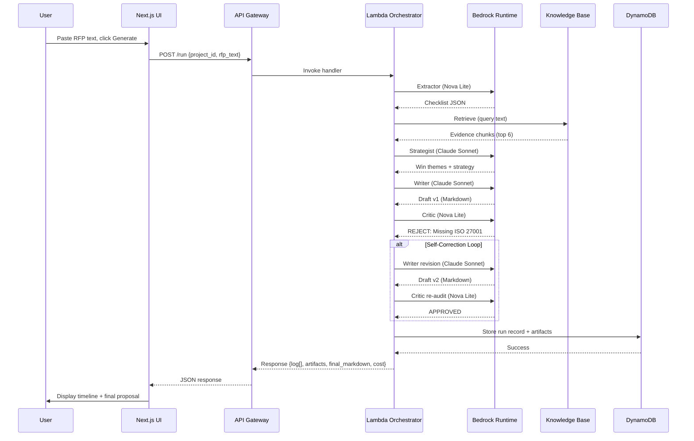
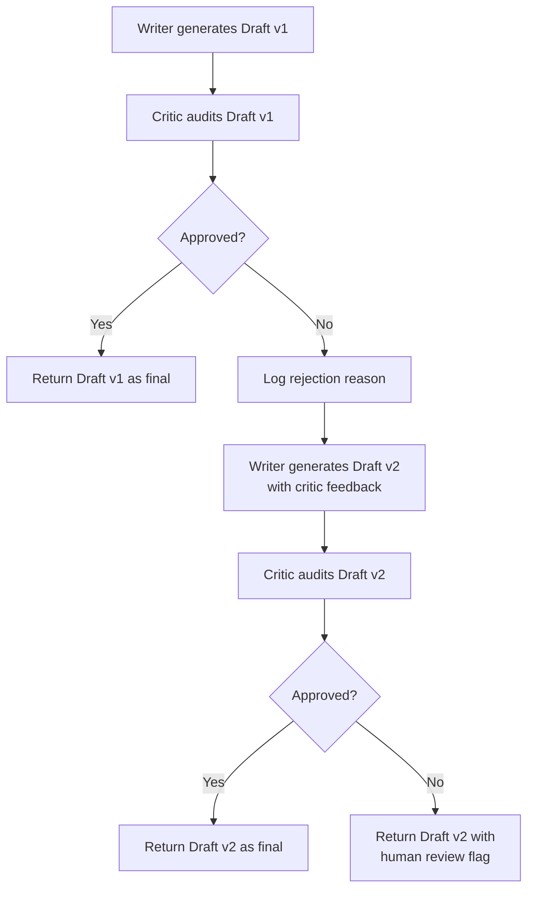

# Design Document: BidFlow RFP Generator

## Overview

BidFlow is an agentic AI SaaS platform that automates the creation of compliant RFP proposal responses. The system orchestrates a multi-agent pipeline (Extractor → Researcher → Strategist → Writer → Critic) that processes RFP text, retrieves evidence from company documents using Amazon Bedrock Knowledge Bases, generates strategic proposals, and implements a self-correction loop where the Critic agent can reject drafts and trigger revisions.

The system is designed for deployment in AWS us-east-1 region with optimization for AWS Free Tier usage. It leverages serverless architecture (Lambda, DynamoDB, S3, API Gateway) and Amazon Bedrock for AI capabilities (Claude 3.5 Sonnet for high-quality writing, Amazon Nova Lite for fast extraction and auditing).

### Key Features

- Multi-agent pipeline with five specialized agents
- RAG-based evidence retrieval from company documentation
- Self-correction loop with automatic revision capability
- Real-time agent timeline visualization
- Run history and artifact storage
- Cost and time savings estimation
- Compliance-focused auditing (ISO 27001, SOC 2, SSO, SLA)

### Design Goals

- Minimize latency while maintaining quality (60-second target for full pipeline)
- Optimize for AWS Free Tier where possible
- Provide transparent, auditable agent execution
- Enable easy testing and demonstration
- Support future authentication integration


## Architecture

### System Architecture Diagram

```mermaid
graph TB
    User[User Browser] --> Amplify[AWS Amplify<br/>Next.js UI]
    Amplify --> APIGW[API Gateway<br/>HTTP API]
    APIGW --> Lambda[Lambda Function<br/>AgentOrchestrator<br/>Python 3.12]
    
    Lambda --> Bedrock[Amazon Bedrock<br/>Runtime]
    Lambda --> BedrockAgent[Bedrock Agent<br/>Runtime]
    Lambda --> DDB[DynamoDB<br/>BidProjectState]
    Lambda --> S3[S3 Bucket<br/>bidflow-documents]
    
    BedrockAgent --> KB[Knowledge Base]
    KB --> OSS[OpenSearch<br/>Serverless]
    KB --> S3
    
    Bedrock -.Claude 3.5 Sonnet.-> Lambda
    Bedrock -.Amazon Nova Lite.-> Lambda
    
    style Lambda fill:#ff9900
    style Bedrock fill:#527fff
    style KB fill:#527fff
    style DDB fill:#527fff
    style S3 fill:#569a31
    style APIGW fill:#ff4f8b
    style Amplify fill:#ff9900
```

### Component Responsibilities

**Frontend (AWS Amplify + Next.js)**
- Provides web interface for RFP input
- Displays real-time agent timeline with animated log entries
- Renders final Markdown proposal and intermediate artifacts
- Shows cost estimates and time savings badges
- Supports demo RFP loading for testing

**API Layer (API Gateway HTTP API)**
- Routes POST /run requests to Lambda orchestrator
- Routes GET /runs requests for history retrieval
- Provides CORS headers for cross-origin access
- Returns JSON responses with appropriate status codes

**Compute Layer (AWS Lambda)**
- Orchestrates multi-agent pipeline execution
- Manages agent sequencing and data flow
- Implements self-correction loop logic
- Handles error logging and fallback behaviors
- Calculates cost estimates
- Persists run history and artifacts to DynamoDB

**AI/RAG Layer (Amazon Bedrock)**
- Claude 3.5 Sonnet: Strategist and Writer agents (high-quality reasoning and writing)
- Amazon Nova Lite: Extractor and Critic agents (fast, cost-effective processing)
- Knowledge Base: RAG retrieval using Retrieve API
- Titan Embeddings v2: Vector embeddings for document chunks
- OpenSearch Serverless: Vector store for similarity search

**Storage Layer**
- S3: Company documentation PDFs (source for Knowledge Base)
- DynamoDB: Run history, artifacts, and execution metadata
- Knowledge Base: Indexed document chunks with vector embeddings


### Request Flow Sequence



### Regional Deployment

All AWS resources are deployed in **us-east-1** region for:
- Optimal model availability (Claude 3.5 Sonnet, Amazon Nova Lite, Titan Embeddings v2)
- Lowest latency for Bedrock API calls
- Consistent regional configuration across all services


## Components and Interfaces

### Multi-Agent Pipeline

#### Agent 1: Extractor (Amazon Nova Lite)

**Purpose:** Parse RFP text into structured requirements checklist

**Input:**
- `rfp_text`: Raw RFP text string

**Output:**
```json
{
  "must_include_terms": ["ISO 27001", "SOC 2", "SSO", "SLA"],
  "must_cover_sections": ["Security & Compliance", "Delivery Plan"],
  "compliance": ["ISO 27001", "SOC 2"],
  "non_functional": ["SLA 99.9%", "Observability"],
  "integration": ["SSO (SAML/OIDC)"],
  "timeline_required": true,
  "word_limit": 650
}
```

**Behavior:**
- Uses Amazon Nova Lite for fast, cost-effective extraction
- Focuses on identifying ISO 27001, SOC 2, SSO (SAML/OIDC), and SLA requirements
- Returns strict JSON (no markdown, no commentary)
- Fallback: If output is not valid JSON, uses default checklist structure

**Model Configuration:**
- Model ID: `amazon.nova-lite-v1:0`
- Max tokens: 600
- Temperature: 0.0 (deterministic)

#### Agent 2: Researcher (Bedrock Knowledge Base)

**Purpose:** Retrieve relevant evidence from company documentation

**Input:**
- `checklist`: Extracted requirements from Extractor
- `rfp_text`: Original RFP text (for context)

**Output:**
```json
[
  {
    "text": "Evidence chunk content...",
    "source": "s3://bidflow-documents/case-study-sso.pdf"
  }
]
```

**Behavior:**
- Queries Knowledge Base using Bedrock Agent Runtime Retrieve API
- Constructs query from compliance, integration, and non-functional requirements
- Retrieves top 6 most relevant document chunks
- Formats evidence with source document URIs for traceability

**API Configuration:**
- API: `bedrock-agent-runtime:Retrieve`
- Vector search configuration: `numberOfResults: 6`
- Query construction: Combines keywords from checklist + RFP excerpt

#### Agent 3: Strategist (Claude 3.5 Sonnet)

**Purpose:** Generate win themes and response strategy

**Input:**
- `rfp_text`: Original RFP text
- `checklist`: Extracted requirements
- `evidence`: Retrieved document chunks

**Output:**
```markdown
Win Themes:
1. [Theme 1]
2. [Theme 2]
3. [Theme 3]

Proof Points:
1. [Point 1 referencing Evidence 1]
2. [Point 2 referencing Evidence 3]
3. [Point 3 referencing Evidence 5]

Risks + Mitigations:
1. Risk: [Risk 1] | Mitigation: [Mitigation 1]
2. Risk: [Risk 2] | Mitigation: [Mitigation 2]
```

**Behavior:**
- Uses Claude 3.5 Sonnet for high-quality strategic reasoning
- Generates exactly 3 win themes based on RFP requirements and evidence
- Generates exactly 3 proof points referencing specific evidence chunks
- Identifies exactly 2 risks with corresponding mitigations

**Model Configuration:**
- Model ID: `anthropic.claude-3-5-sonnet-20240620-v1:0`
- Max tokens: 700
- Temperature: 0.2 (slightly creative)


#### Agent 4: Writer (Claude 3.5 Sonnet)

**Purpose:** Generate formal proposal draft in Markdown

**Input:**
- `must_include_terms`: Terms that must appear in proposal
- `word_limit`: Maximum word count
- `strategy`: Win themes and proof points from Strategist
- `evidence`: Retrieved document chunks
- `critic_feedback` (optional): Feedback from previous rejection

**Output:**
```markdown
# Executive Summary
[Content]

# Understanding of Requirements
[Content]

# Proposed Approach
[Content]

# Delivery Plan
[Content with phases and timeline]

# Security & Compliance
[Content explicitly mentioning ISO 27001, SOC 2, SSO, SLA]

# Relevant Experience
[Content referencing evidence chunks]

# Assumptions and Next Steps
[Content]
```

**Behavior:**
- Uses Claude 3.5 Sonnet for high-quality formal writing
- Generates proposal with all required sections
- Includes all must_include_terms from checklist
- Respects word_limit constraint
- References retrieved evidence in Relevant Experience section
- Incorporates critic feedback when generating revisions

**Model Configuration:**
- Model ID: `anthropic.claude-3-5-sonnet-20240620-v1:0`
- Max tokens: 1100
- Temperature: 0.3 (balanced creativity)
- Revision temperature: 0.25 (slightly more focused)

#### Agent 5: Critic (Amazon Nova Lite)

**Purpose:** Audit proposal for compliance gaps

**Input:**
- `checklist`: Extracted requirements
- `draft`: Proposal draft to audit

**Output:**
```
APPROVED
```
or
```
REJECT: Missing ISO 27001
```

**Behavior:**
- Uses Amazon Nova Lite for fast, cost-effective auditing
- Returns either "APPROVED" or "REJECT: <specific reason>"
- Checks for presence of ISO 27001, SOC 2, SSO, SLA, and timeline requirements
- Validates that draft does not exceed word_limit
- Provides specific rejection reasons for actionable feedback

**Model Configuration:**
- Model ID: `amazon.nova-lite-v1:0`
- Max tokens: 80
- Temperature: 0.0 (deterministic)

**Valid Rejection Reasons:**
- `REJECT: Missing ISO 27001`
- `REJECT: Missing SOC 2`
- `REJECT: Missing SSO`
- `REJECT: Missing SLA`
- `REJECT: Missing timeline`
- `REJECT: Over word limit`


### Self-Correction Loop Implementation

The self-correction loop enables the system to automatically revise rejected drafts:



**Loop Constraints:**
- Maximum of **one revision cycle** per run
- If Draft v2 is rejected, system returns it with human review flag
- Revision prompt includes original strategy + critic feedback
- All drafts and critic responses are stored for transparency

**Rationale:**
- Single retry balances quality improvement with latency/cost control
- Prevents infinite loops while allowing common issues to be fixed
- Provides escape hatch (human review) for complex cases


### API Contracts

#### POST /run

**Purpose:** Execute agent pipeline for RFP proposal generation

**Request:**
```json
{
  "project_id": "demo-001",
  "rfp_text": "We are a B2B SaaS company looking for..."
}
```

**Response (Success - 200):**
```json
{
  "trace_id": "550e8400-e29b-41d4-a716-446655440000",
  "project_id": "demo-001",
  "log": [
    {"agent": "Extractor", "msg": "Parsing RFP into a structured checklist..."},
    {"agent": "Researcher", "msg": "Searching Knowledge Base for relevant evidence..."},
    {"agent": "Researcher", "msg": "Retrieved 6 evidence chunks."},
    {"agent": "Strategist", "msg": "Creating win themes and response plan..."},
    {"agent": "Writer", "msg": "Writing proposal draft (v1)..."},
    {"agent": "Critic", "msg": "Auditing draft for compliance gaps..."},
    {"agent": "Critic", "msg": "REJECT: Missing ISO 27001"},
    {"agent": "Writer", "msg": "Rewriting draft to fix issues (v2)..."},
    {"agent": "Critic", "msg": "Re-auditing revised draft..."},
    {"agent": "Critic", "msg": "APPROVED"}
  ],
  "artifacts": {
    "checklist": { /* JSON object */ },
    "evidence": [ /* array of evidence chunks */ ],
    "strategy": "Win Themes:\n1. ...",
    "draft_v1": "# Executive Summary\n...",
    "critic_v1": "REJECT: Missing ISO 27001",
    "draft_v2": "# Executive Summary\n...",
    "critic_v2": "APPROVED"
  },
  "final_markdown": "# Executive Summary\n...",
  "cost_estimate_usd": 0.04,
  "elapsed_seconds": 42.5
}
```

**Response (Error - 400):**
```json
{
  "error": "rfp_text required"
}
```

**Response (Error - 500):**
```json
{
  "error": "Knowledge Base retrieval failed: [details]"
}
```

**Headers:**
- `Content-Type: application/json`
- `Access-Control-Allow-Origin: *`
- `Access-Control-Allow-Headers: *`
- `Access-Control-Allow-Methods: *`

#### GET /runs

**Purpose:** Retrieve run history for a project

**Request:**
```
GET /runs?project_id=demo-001
```

**Response (Success - 200):**
```json
{
  "project_id": "demo-001",
  "runs": [
    {
      "timestamp": "1704067200",
      "trace_id": "550e8400-e29b-41d4-a716-446655440000",
      "elapsed_seconds": 42.5,
      "cost_estimate_usd": 0.04
    }
  ]
}
```

**Behavior:**
- Returns 10 most recent runs for specified project_id
- Sorted by timestamp descending (newest first)
- Includes summary information only (not full artifacts)


### Frontend Component Architecture

#### Page Structure (Next.js App Router)

```
app/
  page.tsx          # Main application page
  layout.tsx        # Root layout with metadata
  globals.css       # Tailwind CSS styles
```

#### Main Component (`page.tsx`)

**State Management:**
```typescript
const [rfp, setRfp] = useState<string>(DEMO_RFP)
const [running, setRunning] = useState<boolean>(false)
const [log, setLog] = useState<LogItem[]>([])
const [animatedLog, setAnimatedLog] = useState<LogItem[]>([])
const [finalMd, setFinalMd] = useState<string>("")
const [cost, setCost] = useState<number | null>(null)
const [artifacts, setArtifacts] = useState<any>(null)
const [tab, setTab] = useState<TabType>("final")
```

**Layout (3-Column Grid):**

1. **Left Column: Input Panel**
   - Textarea for RFP input (520px height)
   - "Load Demo RFP" button
   - "Generate" button (disabled while running)
   - Cost estimate badge (emerald)
   - Time saved badge (violet)

2. **Middle Column: Agent Timeline**
   - Animated log entries (450ms delay between entries)
   - Each entry shows: `[Agent Name] Message`
   - Scrollable container
   - Empty state: "Run to see agent steps…"

3. **Right Column: Output Panel**
   - Tab navigation: Final, Checklist, Evidence, Strategy, Draft1, Critic1, Draft2, Critic2
   - Markdown rendering (react-markdown + remark-gfm) for Final tab
   - JSON/text display for other tabs
   - Scrollable container (520px height)

**Key Interactions:**
- Load Demo RFP: Populates textarea with demo content
- Generate: Calls POST /run API, displays loading state
- Tab switching: Shows different artifacts from pipeline execution
- Log animation: Progressively reveals log entries with timing effect

**Dependencies:**
- `react-markdown`: Markdown rendering
- `remark-gfm`: GitHub Flavored Markdown support (tables, strikethrough, etc.)
- Tailwind CSS: Styling and responsive layout


## Data Models

### DynamoDB Table: BidProjectState

**Table Configuration:**
- Table name: `BidProjectState`
- Billing mode: Pay-per-request (on-demand)
- Region: us-east-1

**Key Schema:**
```
Partition Key: project_id (String)
Sort Key: timestamp (String)
```

**Item Structure:**
```json
{
  "project_id": "demo-001",
  "timestamp": "1704067200",
  "trace_id": "550e8400-e29b-41d4-a716-446655440000",
  "elapsed_seconds": 42.5,
  "rfp_text": "We are a B2B SaaS company...",
  "checklist": {
    "must_include_terms": ["ISO 27001", "SOC 2", "SSO", "SLA"],
    "must_cover_sections": ["Security & Compliance", "Delivery Plan"],
    "compliance": ["ISO 27001", "SOC 2"],
    "non_functional": ["SLA 99.9%", "Observability"],
    "integration": ["SSO (SAML/OIDC)"],
    "timeline_required": true,
    "word_limit": 650
  },
  "evidence": [
    {
      "text": "Evidence chunk content...",
      "source": "s3://bidflow-documents/case-study-sso.pdf"
    }
  ],
  "strategy": "Win Themes:\n1. ...",
  "draft_v1": "# Executive Summary\n...",
  "critic_v1": "REJECT: Missing ISO 27001",
  "draft_v2": "# Executive Summary\n...",
  "critic_v2": "APPROVED",
  "final_markdown": "# Executive Summary\n...",
  "cost_estimate_usd": 0.04
}
```

**Access Patterns:**

1. **Store run record:**
   - Operation: `PutItem`
   - Key: `{project_id, timestamp}`
   - Use case: Save complete pipeline execution results

2. **Query run history:**
   - Operation: `Query`
   - KeyConditionExpression: `project_id = :pid`
   - ScanIndexForward: `false` (descending order)
   - Limit: 10
   - Use case: Retrieve recent runs for a project

**Rationale for Pay-Per-Request:**
- Unpredictable access patterns during development/demo
- No need to provision capacity
- Optimizes for AWS Free Tier (25 GB storage, 25 WCU, 25 RCU included)


### S3 Bucket: bidflow-documents

**Bucket Configuration:**
- Bucket name: `bidflow-documents`
- Region: us-east-1
- Block public access: Enabled (all settings)
- Versioning: Disabled (not required for prototype)
- Encryption: Server-side encryption (SSE-S3)

**Content Structure:**
```
s3://bidflow-documents/
  company-profile.pdf
  case-study-saas-migration.pdf
  case-study-sso-integration.pdf
  case-study-security-audit.pdf
  capabilities-deck-saas-delivery.pdf
```

**Document Requirements:**
- Format: PDF
- Content focus: SaaS capabilities, compliance (ISO 27001, SOC 2), SSO, SLA, security
- Purpose: Source material for Knowledge Base RAG retrieval

**Access Control:**
- Lambda execution role: `s3:GetObject`, `s3:PutObject`, `s3:ListBucket`
- Knowledge Base service role: `s3:GetObject`, `s3:ListBucket`
- Public access: Blocked

### Knowledge Base Configuration

**Knowledge Base Settings:**
- Name: `BidFlowCompanyMemory`
- Data source: S3 bucket (`bidflow-documents`)
- Embedding model: Titan Embeddings v2 (`amazon.titan-embed-text-v2:0`)
- Vector store: OpenSearch Serverless (quick-create)
- Chunking strategy: Default (300 tokens with 20% overlap)

**Vector Store (OpenSearch Serverless):**
- Collection type: Vector search
- Index name: Auto-generated by Knowledge Base
- Dimensions: 1024 (Titan Embeddings v2)
- Similarity metric: Cosine

**Sync Behavior:**
- Manual sync after uploading/updating PDFs
- Sync creates/updates vector embeddings for all document chunks
- Sync required before retrieval will return results

**Retrieval Configuration:**
- API: `bedrock-agent-runtime:Retrieve`
- Number of results: 6 (top-k)
- Search type: Vector similarity search
- Response includes: Text content + source URI


## Correctness Properties

A property is a characteristic or behavior that should hold true across all valid executions of a system—essentially, a formal statement about what the system should do. Properties serve as the bridge between human-readable specifications and machine-verifiable correctness guarantees.

### Property 1: Input Validation Rejects Empty Content

*For any* input string that is empty or contains only whitespace characters, the system should reject the input and return an error message without executing the agent pipeline.

**Validates: Requirements 1.2**

### Property 2: Agent Execution Order Preservation

*For any* valid RFP input, the system should execute agents in exactly this order: Extractor → Researcher → Strategist → Writer → Critic, with each agent completing before the next begins.

**Validates: Requirements 2.1**

### Property 3: Agent Output Propagation

*For any* agent in the pipeline, the output produced by that agent should be available as input to the next agent in the sequence.

**Validates: Requirements 2.2**

### Property 4: Timeline Logging Completeness

*For any* agent execution, the system should emit a log entry containing both the agent name and a descriptive message, and all log entries should be recorded in the timeline in chronological order.

**Validates: Requirements 2.3, 11.1, 11.2, 11.4**

### Property 5: Error Logging and Propagation

*For any* agent failure, the system should log the error to CloudWatch Logs with a trace_id and return a descriptive error message to the caller with an appropriate HTTP status code.

**Validates: Requirements 2.5, 19.1, 19.5**

### Property 6: Extractor Output Structure

*For any* RFP text input, the Extractor agent should return a JSON object containing the fields: must_include_terms, must_cover_sections, compliance, non_functional, integration, timeline_required, and word_limit.

**Validates: Requirements 3.1**

### Property 7: Extractor Compliance Detection

*For any* RFP text containing the terms "ISO 27001", "SOC 2", "SSO", "SAML", "OIDC", or "SLA", the Extractor should include these terms in the appropriate checklist fields (compliance or integration).

**Validates: Requirements 3.3**

### Property 8: Extractor Fallback Behavior

*For any* Extractor output that is not valid JSON, the system should use a default checklist structure and log a warning message.

**Validates: Requirements 3.4, 19.2**

### Property 9: Researcher Result Count and Format

*For any* retrieval query, the Researcher should return at most 6 evidence chunks, and each chunk should include both text content and a source URI.

**Validates: Requirements 4.2, 4.3**

### Property 10: Strategist Output Structure

*For any* valid inputs (RFP, checklist, evidence), the Strategist should generate output containing exactly 3 win themes, exactly 3 proof points, and exactly 2 risks with mitigations, all within 700 tokens.

**Validates: Requirements 5.1, 5.2, 5.3, 5.5**


### Property 11: Writer Section Completeness

*For any* valid inputs (strategy, evidence, checklist), the Writer should generate a Markdown proposal containing all required sections: Executive Summary, Understanding of Requirements, Proposed Approach, Delivery Plan, Security & Compliance, Relevant Experience, and Assumptions and Next Steps.

**Validates: Requirements 6.1**

### Property 12: Writer Term Inclusion

*For any* checklist with must_include_terms, the Writer should include all those terms in the generated draft proposal.

**Validates: Requirements 6.3**

### Property 13: Writer Word Limit Compliance

*For any* checklist with a word_limit, the Writer should generate a draft that does not exceed that word limit.

**Validates: Requirements 6.4**

### Property 14: Writer Evidence References

*For any* set of evidence chunks provided to the Writer, the Relevant Experience section of the generated proposal should contain references to those evidence chunks.

**Validates: Requirements 6.5**

### Property 15: Critic Output Format

*For any* draft audit, the Critic should return output that matches exactly one of two patterns: "APPROVED" or "REJECT: <specific reason>".

**Validates: Requirements 7.2**

### Property 16: Critic Compliance Checking

*For any* draft that is missing required compliance terms (ISO 27001, SOC 2, SSO, SLA, or timeline) when those terms are in the checklist, the Critic should return a REJECT status with a specific reason identifying the missing term.

**Validates: Requirements 7.3**

### Property 17: Critic Word Limit Enforcement

*For any* draft that exceeds the word_limit specified in the checklist, the Critic should return "REJECT: Over word limit".

**Validates: Requirements 7.4**

### Property 18: Critic Token Limit

*For any* audit, the Critic should complete its response within 80 tokens.

**Validates: Requirements 7.6**

### Property 19: Self-Correction Trigger

*For any* Critic response that starts with "REJECT", the system should trigger the Writer to generate a revised draft (draft_v2) incorporating the Critic's feedback.

**Validates: Requirements 8.1, 8.2**

### Property 20: Self-Correction Re-Audit

*For any* revised draft (draft_v2), the system should trigger the Critic to re-audit the revised draft.

**Validates: Requirements 8.3**

### Property 21: Single Revision Limit

*For any* pipeline execution, the system should perform at most one revision cycle (one draft_v2 generation and one re-audit).

**Validates: Requirements 8.4**

### Property 22: Human Review Flag

*For any* revised draft (draft_v2) that receives a REJECT status from the Critic, the system should return that draft with a human review flag or indicator.

**Validates: Requirements 8.5**


### Property 23: Run Persistence

*For any* completed pipeline execution, the system should store a record in DynamoDB with project_id as partition key, timestamp as sort key, and all required artifacts (checklist, evidence, strategy, draft_v1, critic_v1, draft_v2, critic_v2, final_markdown).

**Validates: Requirements 9.1, 9.2**

### Property 24: Run History Query

*For any* project_id with stored runs, querying run history should return the 10 most recent runs sorted by timestamp in descending order.

**Validates: Requirements 9.4**

### Property 25: Cost Calculation Presence

*For any* completed pipeline execution, the system should calculate and return an estimated cost in USD.

**Validates: Requirements 10.1**

### Property 26: Revision Cost Inclusion

*For any* pipeline execution that includes a self-correction loop (draft_v2 exists), the estimated cost should be higher than the base cost for a single-draft execution.

**Validates: Requirements 10.2**

### Property 27: Trace ID Propagation

*For any* log entry generated during pipeline execution, the entry should include the trace_id for request correlation.

**Validates: Requirements 19.4**

### Property 28: Retrieval Failure Handling

*For any* Knowledge Base retrieval failure, the system should return an error message indicating retrieval failure and log the error to CloudWatch.

**Validates: Requirements 19.3**

### Property 29: CORS Headers

*For any* API response, the response should include CORS headers allowing all origins (Access-Control-Allow-Origin: *).

**Validates: Requirements 13.4**

### Property 30: JSON Response Format

*For any* API request, the response should be valid JSON with an appropriate HTTP status code (200 for success, 400 for client errors, 500 for server errors).

**Validates: Requirements 13.5**

### Property 31: Final Output Markdown Format

*For any* completed pipeline execution, the final_markdown output should be valid Markdown that can be parsed and rendered.

**Validates: Requirements 12.1**


## Error Handling

### Error Categories and Responses

#### 1. Input Validation Errors (400 Bad Request)

**Scenario:** Empty or missing RFP text
```json
{
  "error": "rfp_text required"
}
```

**Handling:**
- Validate input before pipeline execution
- Return immediately without invoking agents
- Log validation failure with trace_id

#### 2. Agent Execution Errors (500 Internal Server Error)

**Scenario:** Bedrock model invocation fails
```json
{
  "error": "Extractor agent failed: [Bedrock error details]"
}
```

**Handling:**
- Catch exceptions during agent execution
- Log full error details to CloudWatch with trace_id
- Return descriptive error message to frontend
- Do not proceed to next agent in pipeline

#### 3. Knowledge Base Retrieval Errors (500 Internal Server Error)

**Scenario:** Retrieve API call fails
```json
{
  "error": "Knowledge Base retrieval failed: [error details]"
}
```

**Handling:**
- Catch exceptions during KB retrieval
- Log error with trace_id and query details
- Return error message indicating retrieval failure
- Do not proceed to Strategist agent

#### 4. Invalid JSON from Extractor (Fallback)

**Scenario:** Extractor returns non-JSON or malformed JSON

**Handling:**
- Attempt to parse JSON from response
- If parsing fails, use default checklist structure:
```json
{
  "must_include_terms": ["ISO 27001", "SOC 2", "SSO", "SLA"],
  "must_cover_sections": ["Security & Compliance", "Delivery Plan"],
  "compliance": ["ISO 27001", "SOC 2"],
  "integration": ["SSO (SAML/OIDC)"],
  "non_functional": ["SLA 99.9%", "Observability"],
  "timeline_required": true,
  "word_limit": 650
}
```
- Log warning message with trace_id
- Continue pipeline execution with fallback checklist

#### 5. DynamoDB Persistence Errors (500 Internal Server Error)

**Scenario:** PutItem operation fails

**Handling:**
- Log error with trace_id and item details
- Return error message to frontend
- Note: Pipeline execution completed successfully, only persistence failed
- Consider retry logic for transient failures

### Error Logging Strategy

**CloudWatch Log Structure:**
```json
{
  "timestamp": "2024-01-01T12:00:00Z",
  "trace_id": "550e8400-e29b-41d4-a716-446655440000",
  "level": "ERROR",
  "agent": "Extractor",
  "error_type": "BedrockInvocationError",
  "error_message": "Model invocation failed: throttling",
  "context": {
    "project_id": "demo-001",
    "rfp_text_length": 1500
  }
}
```

**Log Levels:**
- `ERROR`: Agent failures, API errors, persistence failures
- `WARN`: Fallback behaviors (invalid JSON), retrieval returning fewer than expected results
- `INFO`: Normal agent execution steps, pipeline completion
- `DEBUG`: Detailed request/response payloads (disabled in production)

### Retry and Timeout Strategy

**Bedrock API Calls:**
- No automatic retries (rely on Bedrock SDK defaults)
- Timeout: Inherit from Lambda function timeout (60 seconds)
- Throttling: Return error to user, suggest retry

**Knowledge Base Retrieval:**
- No automatic retries
- Timeout: 10 seconds
- Empty results: Not an error, continue with empty evidence array

**DynamoDB Operations:**
- Use SDK default retry behavior (exponential backoff)
- Timeout: 5 seconds per operation


## Testing Strategy

### Dual Testing Approach

The testing strategy employs both unit tests and property-based tests to ensure comprehensive coverage:

- **Unit tests**: Verify specific examples, edge cases, error conditions, and integration points
- **Property-based tests**: Verify universal properties across randomized inputs

Both approaches are complementary and necessary. Unit tests catch concrete bugs and validate specific scenarios, while property-based tests verify general correctness across a wide input space.

### Unit Testing Focus Areas

**1. API Endpoint Testing**
- POST /run with valid RFP text returns 200 with expected structure
- POST /run with empty RFP text returns 400 with error message
- GET /runs with valid project_id returns run history
- Response headers include CORS headers

**2. Agent Integration Testing**
- Extractor with demo RFP produces valid checklist
- Researcher with sample query returns evidence chunks
- Writer with sample inputs produces Markdown with required sections
- Critic with compliant draft returns APPROVED
- Critic with non-compliant draft returns REJECT with reason

**3. Self-Correction Loop Testing**
- Draft missing ISO 27001 triggers revision
- Revised draft includes ISO 27001 and gets approved
- Second rejection returns draft with human review indicator

**4. Error Handling Testing**
- Invalid JSON from Extractor triggers fallback checklist
- Bedrock API failure returns 500 with error message
- DynamoDB failure logs error and returns error response

**5. UI Component Testing**
- Load Demo RFP button populates textarea
- Generate button triggers API call and displays loading state
- Timeline animates log entries with correct timing
- Markdown rendering displays all supported elements
- Tab switching shows correct artifacts

### Property-Based Testing Configuration

**Framework Selection:**
- Python backend: `hypothesis` library
- TypeScript/JavaScript: `fast-check` library

**Test Configuration:**
- Minimum 100 iterations per property test
- Each test tagged with feature name and property number
- Tag format: `# Feature: bidflow-rfp-generator, Property {N}: {property_text}`

**Property Test Implementation Guidelines:**

Each correctness property from the design document should be implemented as a single property-based test. For example:

```python
# Feature: bidflow-rfp-generator, Property 1: Input Validation Rejects Empty Content
@given(st.text().filter(lambda s: s.strip() == ""))
@settings(max_examples=100)
def test_empty_input_rejection(empty_input):
    response = handler({"body": json.dumps({"rfp_text": empty_input})}, {})
    assert response["statusCode"] == 400
    assert "error" in json.loads(response["body"])
```

```python
# Feature: bidflow-rfp-generator, Property 6: Extractor Output Structure
@given(st.text(min_size=50))
@settings(max_examples=100)
def test_extractor_output_structure(rfp_text):
    checklist = extract_requirements(rfp_text)
    required_fields = [
        "must_include_terms", "must_cover_sections", "compliance",
        "non_functional", "integration", "timeline_required", "word_limit"
    ]
    for field in required_fields:
        assert field in checklist
```

### Test Data Strategy

**Demo RFP Content:**
```text
We are a B2B SaaS company looking for a partner to modernize our platform.

Must include:
- Explicit mention of ISO 27001 and SOC 2 alignment
- SSO via SAML 2.0 or OIDC
- SLA: 99.9% uptime
- A delivery timeline with phases (Discovery, Build, Security review, Launch)
- References to relevant past SaaS projects
```

**Purpose:** Guaranteed to trigger self-correction loop (first draft missing compliance terms)

**Company Documentation PDFs:**
1. Company Profile (mentions ISO 27001 & SOC 2)
2. Case Study - SaaS Cloud Migration (SLA outcomes)
3. Case Study - SSO Integration (SAML/OIDC)
4. Case Study - Security Audit (ISO/SOC wording)
5. Capabilities Deck - SaaS Delivery (multi-tenancy, encryption, SLAs)

**Purpose:** Provide realistic evidence for RAG retrieval

### Integration Testing

**End-to-End Pipeline Test:**
1. Deploy full stack (CDK, Lambda, API Gateway, Knowledge Base)
2. Upload test PDFs to S3 and sync Knowledge Base
3. Call POST /run with demo RFP
4. Verify response contains all expected artifacts
5. Verify DynamoDB record was created
6. Call GET /runs and verify history retrieval

**Expected Behavior:**
- Extractor identifies ISO 27001, SOC 2, SSO, SLA requirements
- Researcher retrieves 6 evidence chunks from test PDFs
- Strategist generates 3 win themes, 3 proof points, 2 risks
- Writer generates draft with all required sections
- Critic rejects draft_v1 (missing compliance term)
- Writer generates draft_v2 with compliance terms
- Critic approves draft_v2
- Final output is valid Markdown

### Performance Testing

While not part of unit/property tests, the following performance targets should be validated manually:

- Full pipeline execution: < 60 seconds
- Empty input validation: < 200 milliseconds
- Run history query: < 500 milliseconds
- Knowledge Base retrieval: < 10 seconds

### Test Coverage Goals

- Unit test coverage: > 80% of backend code
- Property test coverage: All 31 correctness properties implemented
- Integration test coverage: Full happy path + major error scenarios
- UI component coverage: All interactive elements and state transitions


## Security and IAM Design

### S3 Bucket Security

**Block Public Access:**
- All block public access settings enabled
- No bucket policies allowing public read
- No ACLs granting public access

**Encryption:**
- Server-side encryption (SSE-S3) enabled by default
- All objects encrypted at rest

**Access Control:**
- Lambda execution role: `s3:GetObject`, `s3:PutObject`, `s3:ListBucket` scoped to bucket ARN
- Knowledge Base service role: `s3:GetObject`, `s3:ListBucket` scoped to bucket ARN
- No cross-account access

### Lambda Execution Role

**IAM Policy (Least Privilege):**

```json
{
  "Version": "2012-10-17",
  "Statement": [
    {
      "Sid": "CloudWatchLogs",
      "Effect": "Allow",
      "Action": [
        "logs:CreateLogGroup",
        "logs:CreateLogStream",
        "logs:PutLogEvents"
      ],
      "Resource": "arn:aws:logs:us-east-1:*:*"
    },
    {
      "Sid": "DynamoDBAccess",
      "Effect": "Allow",
      "Action": [
        "dynamodb:PutItem",
        "dynamodb:Query"
      ],
      "Resource": "arn:aws:dynamodb:us-east-1:ACCOUNT_ID:table/BidProjectState"
    },
    {
      "Sid": "S3BucketAccess",
      "Effect": "Allow",
      "Action": ["s3:ListBucket"],
      "Resource": "arn:aws:s3:::bidflow-documents"
    },
    {
      "Sid": "S3ObjectAccess",
      "Effect": "Allow",
      "Action": [
        "s3:GetObject",
        "s3:PutObject"
      ],
      "Resource": "arn:aws:s3:::bidflow-documents/*"
    },
    {
      "Sid": "BedrockModelInvoke",
      "Effect": "Allow",
      "Action": ["bedrock:InvokeModel"],
      "Resource": [
        "arn:aws:bedrock:us-east-1::foundation-model/anthropic.claude-3-5-sonnet-20240620-v1:0",
        "arn:aws:bedrock:us-east-1::foundation-model/amazon.nova-lite-v1:0"
      ]
    },
    {
      "Sid": "BedrockKnowledgeBaseRetrieve",
      "Effect": "Allow",
      "Action": ["bedrock-agent-runtime:Retrieve"],
      "Resource": "*"
    }
  ]
}
```

**Rationale:**
- CloudWatch Logs: Required for Lambda logging
- DynamoDB: Scoped to specific table, only PutItem and Query (no Scan, DeleteItem)
- S3: Scoped to specific bucket, no DeleteObject permission
- Bedrock: Scoped to specific model ARNs where possible
- Knowledge Base: Requires wildcard due to dynamic KB IDs

### API Gateway Security

**Prototype Configuration:**
- No authentication required (open access)
- CORS enabled for all origins
- Rate limiting: Default API Gateway throttling (10,000 requests/second)

**Future Authentication Integration:**
- Design supports adding AWS IAM authentication
- Design supports adding Cognito User Pools
- Design supports adding Lambda authorizers
- No code changes required in Lambda handler

**Rationale:**
- Prototype focuses on functionality demonstration
- Authentication adds complexity not required for hackathon
- Architecture designed to easily add auth layer later

### Knowledge Base Security

**Data Access:**
- Knowledge Base service role has read-only access to S3 bucket
- Documents not exposed through public endpoints
- Retrieval API requires AWS credentials (Lambda execution role)

**Vector Store (OpenSearch Serverless):**
- Network access: VPC-isolated (not public)
- Encryption: At rest and in transit
- Access control: IAM-based, scoped to Knowledge Base service role

### Environment Variables Security

**Sensitive Configuration:**
- `KNOWLEDGE_BASE_ID`: Not sensitive, but stored as env var for flexibility
- `TABLE_NAME`, `BUCKET_NAME`: Not sensitive
- `REGION`: Not sensitive
- `CLAUDE_MODEL_ID`, `NOVA_LITE_MODEL_ID`: Not sensitive

**No Secrets Required:**
- AWS credentials provided by Lambda execution role
- No API keys or passwords needed
- No database connection strings

### Data Privacy Considerations

**RFP Text:**
- Stored in DynamoDB with project_id scoping
- Not encrypted beyond DynamoDB default encryption
- Consider adding field-level encryption for production

**Generated Proposals:**
- Stored in DynamoDB as artifacts
- Accessible via API to anyone with project_id
- Consider adding authentication for production

**Company Documents:**
- Stored in S3 with encryption at rest
- Not publicly accessible
- Access controlled via IAM roles

### Compliance Considerations

**For Production Deployment:**
- Enable CloudTrail for API audit logging
- Enable VPC Flow Logs if using VPC
- Implement authentication and authorization
- Add field-level encryption for sensitive data
- Implement data retention policies
- Add monitoring and alerting for security events


## CDK Infrastructure Design

### Stack Structure

**CDK Stack Name:** `BidFlowStack`

**CDK Version:** aws-cdk-lib v2

**Language:** TypeScript

### Resource Definitions

#### 1. S3 Bucket

```typescript
const documentsBucket = new s3.Bucket(this, 'DocumentsBucket', {
  bucketName: 'bidflow-documents',
  blockPublicAccess: s3.BlockPublicAccess.BLOCK_ALL,
  encryption: s3.BucketEncryption.S3_MANAGED,
  removalPolicy: cdk.RemovalPolicy.RETAIN,
});
```

**Configuration:**
- Block all public access
- Server-side encryption enabled
- Retain bucket on stack deletion (preserve documents)

#### 2. DynamoDB Table

```typescript
const stateTable = new dynamodb.Table(this, 'StateTable', {
  tableName: 'BidProjectState',
  partitionKey: { name: 'project_id', type: dynamodb.AttributeType.STRING },
  sortKey: { name: 'timestamp', type: dynamodb.AttributeType.STRING },
  billingMode: dynamodb.BillingMode.PAY_PER_REQUEST,
  removalPolicy: cdk.RemovalPolicy.RETAIN,
});
```

**Configuration:**
- Pay-per-request billing (no provisioned capacity)
- Composite key: project_id (PK) + timestamp (SK)
- Retain table on stack deletion (preserve history)

#### 3. Lambda Function

```typescript
const orchestratorFn = new lambda.Function(this, 'OrchestratorFunction', {
  functionName: 'AgentOrchestrator',
  runtime: lambda.Runtime.PYTHON_3_12,
  handler: 'handler.handler',
  code: lambda.Code.fromAsset('../backend/src'),
  timeout: cdk.Duration.seconds(60),
  memorySize: 1024,
  environment: {
    REGION: 'us-east-1',
    TABLE_NAME: stateTable.tableName,
    BUCKET_NAME: documentsBucket.bucketName,
    KNOWLEDGE_BASE_ID: '<placeholder>',
    CLAUDE_MODEL_ID: 'anthropic.claude-3-5-sonnet-20240620-v1:0',
    NOVA_LITE_MODEL_ID: 'amazon.nova-lite-v1:0',
  },
});
```

**Configuration:**
- Python 3.12 runtime
- 60-second timeout (full pipeline execution)
- 1024 MB memory (balance between cost and performance)
- Environment variables for configuration

**Note:** `KNOWLEDGE_BASE_ID` must be updated after creating Knowledge Base manually

#### 4. IAM Permissions

```typescript
// DynamoDB permissions
stateTable.grantReadWriteData(orchestratorFn);

// S3 permissions
documentsBucket.grantReadWrite(orchestratorFn);

// Bedrock permissions
orchestratorFn.addToRolePolicy(new iam.PolicyStatement({
  effect: iam.Effect.ALLOW,
  actions: ['bedrock:InvokeModel'],
  resources: [
    'arn:aws:bedrock:us-east-1::foundation-model/anthropic.claude-3-5-sonnet-20240620-v1:0',
    'arn:aws:bedrock:us-east-1::foundation-model/amazon.nova-lite-v1:0',
  ],
}));

orchestratorFn.addToRolePolicy(new iam.PolicyStatement({
  effect: iam.Effect.ALLOW,
  actions: ['bedrock-agent-runtime:Retrieve'],
  resources: ['*'],
}));

// CloudWatch Logs (automatically granted by CDK)
```

#### 5. API Gateway HTTP API

```typescript
const httpApi = new apigatewayv2.HttpApi(this, 'HttpApi', {
  apiName: 'BidFlowApi',
  corsPreflight: {
    allowOrigins: ['*'],
    allowMethods: [apigatewayv2.CorsHttpMethod.GET, apigatewayv2.CorsHttpMethod.POST],
    allowHeaders: ['*'],
  },
});

const integration = new apigatewayv2_integrations.HttpLambdaIntegration(
  'OrchestratorIntegration',
  orchestratorFn
);

httpApi.addRoutes({
  path: '/run',
  methods: [apigatewayv2.HttpMethod.POST],
  integration,
});

httpApi.addRoutes({
  path: '/runs',
  methods: [apigatewayv2.HttpMethod.GET],
  integration,
});
```

**Configuration:**
- HTTP API (not REST API) for lower cost and latency
- CORS enabled for all origins
- Two routes: POST /run, GET /runs
- Single Lambda integration for both routes

#### 6. Stack Outputs

```typescript
new cdk.CfnOutput(this, 'HttpApiUrl', {
  value: httpApi.url!,
  description: 'API Gateway URL',
});

new cdk.CfnOutput(this, 'BucketName', {
  value: documentsBucket.bucketName,
  description: 'S3 bucket for company documents',
});

new cdk.CfnOutput(this, 'TableName', {
  value: stateTable.tableName,
  description: 'DynamoDB table for run history',
});
```

**Outputs:**
- API Gateway URL (for frontend configuration)
- S3 bucket name (for document uploads)
- DynamoDB table name (for verification)

### Deployment Process

**Prerequisites:**
1. AWS CLI configured with credentials
2. Node.js 18+ installed
3. AWS CDK CLI installed (`npm install -g aws-cdk`)
4. Backend code in `../backend/src` directory

**Deployment Commands:**

```bash
cd infra
npm install
cdk bootstrap  # First time only
cdk deploy
```

**Post-Deployment Steps:**
1. Note the API Gateway URL from stack outputs
2. Create Knowledge Base in AWS Console
3. Upload PDFs to S3 bucket
4. Sync Knowledge Base
5. Update Lambda environment variable `KNOWLEDGE_BASE_ID`
6. Configure frontend with API Gateway URL

### Cost Optimization

**Free Tier Considerations:**
- Lambda: 1M requests/month, 400,000 GB-seconds compute
- DynamoDB: 25 GB storage, 25 WCU, 25 RCU
- S3: 5 GB storage, 20,000 GET requests, 2,000 PUT requests
- API Gateway: 1M requests/month (HTTP API)

**Estimated Monthly Cost (Beyond Free Tier):**
- Lambda: ~$0.20 per 1,000 executions
- Bedrock: ~$0.03-0.04 per pipeline run (Claude + Nova)
- DynamoDB: Pay-per-request, ~$0.25 per million writes
- S3: Minimal (< $0.10 for 5 PDFs)
- OpenSearch Serverless: ~$0.24/hour (~$175/month) - **Largest cost**

**Optimization Strategies:**
- Use pay-per-request billing for DynamoDB (no idle cost)
- Minimize Lambda memory to 1024 MB (balance performance/cost)
- Use Nova Lite for fast/cheap operations (Extractor, Critic)
- Limit retrieval to 6 chunks (reduce KB query cost)
- Single revision cycle (control Bedrock API calls)


## Deployment Architecture

### AWS Amplify Hosting

**Deployment Method:** Git-based continuous deployment

**Configuration:**

1. **Repository Connection:**
   - Connect Amplify to GitHub/GitLab repository
   - Select branch for deployment (e.g., `main`)
   - Amplify auto-detects Next.js framework

2. **Build Settings:**
   ```yaml
   version: 1
   frontend:
     phases:
       preBuild:
         commands:
           - npm ci
       build:
         commands:
           - npm run build
     artifacts:
       baseDirectory: .next
       files:
         - '**/*'
     cache:
       paths:
         - node_modules/**/*
   ```

3. **Environment Variables:**
   - `NEXT_PUBLIC_API_BASE_URL`: API Gateway URL from CDK output
   - Example: `https://abc123.execute-api.us-east-1.amazonaws.com`

4. **Domain:**
   - Amplify provides default domain: `https://main.d1234567890.amplifyapp.com`
   - Custom domain can be configured (optional)

**Deployment Trigger:**
- Automatic rebuild and deploy on Git push to connected branch
- Build time: ~2-3 minutes for Next.js app
- Zero-downtime deployment

### Regional Architecture

**All resources in us-east-1:**

```
┌─────────────────────────────────────────────────────────┐
│                     us-east-1 Region                     │
├─────────────────────────────────────────────────────────┤
│                                                          │
│  ┌──────────────┐      ┌──────────────┐                │
│  │   Amplify    │      │ API Gateway  │                │
│  │   Hosting    │─────▶│   HTTP API   │                │
│  └──────────────┘      └──────┬───────┘                │
│                               │                          │
│                        ┌──────▼───────┐                 │
│                        │    Lambda    │                 │
│                        │ Orchestrator │                 │
│                        └──────┬───────┘                 │
│                               │                          │
│         ┌─────────────────────┼─────────────────────┐   │
│         │                     │                     │   │
│    ┌────▼────┐         ┌─────▼─────┐        ┌─────▼──┐│
│    │ Bedrock │         │ DynamoDB  │        │   S3   ││
│    │ Runtime │         │   Table   │        │ Bucket ││
│    └────┬────┘         └───────────┘        └────┬───┘│
│         │                                         │    │
│    ┌────▼────────┐                               │    │
│    │  Knowledge  │───────────────────────────────┘    │
│    │    Base     │                                     │
│    └────┬────────┘                                     │
│         │                                              │
│    ┌────▼────────┐                                     │
│    │ OpenSearch  │                                     │
│    │ Serverless  │                                     │
│    └─────────────┘                                     │
│                                                         │
└─────────────────────────────────────────────────────────┘
```

**Rationale for us-east-1:**
- Claude 3.5 Sonnet availability
- Amazon Nova Lite availability
- Titan Embeddings v2 availability
- Lowest latency for Bedrock API calls
- Most mature Bedrock feature set

### Monitoring and Observability

**CloudWatch Logs:**
- Lambda function logs: `/aws/lambda/AgentOrchestrator`
- Log retention: 7 days (configurable)
- Log structure: JSON with trace_id for correlation

**CloudWatch Metrics:**
- Lambda invocations, duration, errors, throttles
- API Gateway request count, latency, 4xx/5xx errors
- DynamoDB consumed capacity, throttled requests

**Recommended Alarms:**
- Lambda error rate > 5%
- API Gateway 5xx error rate > 1%
- Lambda duration > 55 seconds (approaching timeout)
- DynamoDB throttled requests > 0

**Distributed Tracing:**
- trace_id generated for each request
- Propagated through all log entries
- Enables end-to-end request tracking

### Disaster Recovery

**Backup Strategy:**
- DynamoDB: Point-in-time recovery (optional, not enabled by default)
- S3: Versioning disabled (not required for prototype)
- Knowledge Base: Can be recreated from S3 documents

**Recovery Procedures:**
1. **Lambda failure:** Automatic retry by API Gateway
2. **DynamoDB unavailable:** Return 500 error, retry request
3. **S3 unavailable:** Knowledge Base retrieval fails, return error
4. **Bedrock throttling:** Return error, user retries
5. **Complete region failure:** No cross-region failover (prototype)

**Data Loss Scenarios:**
- DynamoDB table deleted: Run history lost (no backup)
- S3 bucket deleted: Company documents lost (manual restore from source)
- Knowledge Base deleted: Can be recreated and re-synced


## Implementation Guidance

### Development Workflow

**Phase A: Infrastructure Setup**
1. Use Kiro to generate CDK stack (screenshot for documentation)
2. Deploy CDK stack: `cdk deploy`
3. Note outputs: API Gateway URL, S3 bucket name, DynamoDB table name

**Phase B: Knowledge Base Setup**
1. Create 5 company documentation PDFs (SaaS-focused content)
2. Upload PDFs to S3 bucket
3. Create Knowledge Base in AWS Console
4. Configure: S3 data source, Titan Embeddings v2, OpenSearch Serverless
5. Sync Knowledge Base
6. Test retrieval with sample query
7. Update Lambda environment variable: `KNOWLEDGE_BASE_ID`

**Phase C: Backend Implementation**
1. Implement `bedrock.py`: Model invocation and KB retrieval functions
2. Implement `prompts.py`: Prompt templates for all agents
3. Implement `dynamo.py`: DynamoDB persistence helpers
4. Implement `cost.py`: Cost estimation logic
5. Implement `handler.py`: Lambda entry point and orchestration
6. Test locally with sample RFP text
7. Deploy: `cdk deploy` (updates Lambda code)

**Phase D: Frontend Implementation**
1. Create Next.js app: `npx create-next-app@latest bidflow-ui`
2. Install dependencies: `react-markdown`, `remark-gfm`
3. Implement main page component with 3-column layout
4. Implement API integration (POST /run, GET /runs)
5. Implement timeline animation logic
6. Implement Markdown rendering
7. Test locally: `npm run dev`
8. Deploy to Amplify: Connect Git repo, configure env vars

**Phase E: Testing and Demo**
1. Test end-to-end with demo RFP
2. Verify self-correction loop triggers
3. Verify all artifacts are stored
4. Test error scenarios
5. Record demo video
6. Capture screenshots for documentation

### Key Implementation Decisions

**Why Retrieve API instead of RetrieveAndGenerate:**
- Retrieve API returns raw evidence chunks for transparency
- RetrieveAndGenerate combines retrieval + generation, hiding intermediate steps
- Multi-agent pipeline requires explicit control over each step
- Judges need to see evidence retrieval as separate step

**Why Single Revision Cycle:**
- Balances quality improvement with latency/cost control
- Prevents infinite loops
- Most compliance issues fixed in one revision
- Provides escape hatch (human review) for complex cases

**Why Nova Lite for Extractor/Critic:**
- Fast response times (< 1 second)
- Cost-effective for simple tasks
- Deterministic output (temperature 0.0)
- Sufficient capability for structured extraction and validation

**Why Claude Sonnet for Strategist/Writer:**
- High-quality reasoning and writing
- Better understanding of business context
- More coherent long-form content
- Worth the cost for customer-facing output

**Why Pay-Per-Request DynamoDB:**
- Unpredictable access patterns during development
- No idle cost when not in use
- Simplifies capacity planning
- Optimizes for AWS Free Tier

**Why HTTP API instead of REST API:**
- Lower cost ($1.00 vs $3.50 per million requests)
- Lower latency (simpler routing)
- Sufficient features for prototype
- Easy to upgrade to REST API later if needed

### Code Organization Best Practices

**Backend Structure:**
```
backend/
  src/
    handler.py          # Lambda entry point, routing, orchestration
    bedrock.py          # Bedrock API wrappers (invoke, retrieve)
    prompts.py          # Prompt templates (constants)
    dynamo.py           # DynamoDB helpers (save, query)
    cost.py             # Cost estimation logic
  requirements.txt      # Python dependencies
  tests/
    test_handler.py     # Unit tests
    test_properties.py  # Property-based tests
```

**Frontend Structure:**
```
frontend/bidflow-ui/
  app/
    page.tsx            # Main application page
    layout.tsx          # Root layout
    globals.css         # Tailwind styles
  public/
    demo-rfp.txt        # Demo RFP content
  package.json          # Dependencies
```

**Infrastructure Structure:**
```
infra/
  lib/
    bidflow-stack.ts    # CDK stack definition
  bin/
    bidflow.ts          # CDK app entry point
  cdk.json              # CDK configuration
  package.json          # CDK dependencies
```

### Environment Configuration

**Local Development:**
```bash
# Backend
export AWS_PROFILE=your-profile
export AWS_REGION=us-east-1
export TABLE_NAME=BidProjectState
export BUCKET_NAME=bidflow-documents
export KNOWLEDGE_BASE_ID=your-kb-id
export CLAUDE_MODEL_ID=anthropic.claude-3-5-sonnet-20240620-v1:0
export NOVA_LITE_MODEL_ID=amazon.nova-lite-v1:0

# Frontend
export NEXT_PUBLIC_API_BASE_URL=http://localhost:3000/api
```

**Production (Lambda):**
- Environment variables set by CDK stack
- AWS credentials from execution role
- No secrets in environment variables

**Production (Amplify):**
- `NEXT_PUBLIC_API_BASE_URL` set in Amplify console
- Automatically injected during build

### Troubleshooting Guide

**Issue: Extractor returns invalid JSON**
- Check prompt template formatting
- Verify Nova Lite model access enabled
- Review CloudWatch logs for raw response
- Fallback checklist should activate automatically

**Issue: Knowledge Base retrieval returns no results**
- Verify Knowledge Base sync completed
- Check S3 bucket contains PDFs
- Test retrieval in AWS Console
- Verify Lambda has bedrock-agent-runtime:Retrieve permission

**Issue: Self-correction loop not triggering**
- Verify demo RFP is missing compliance terms
- Check Critic prompt template
- Review Critic response in logs
- Ensure Writer revision logic is correct

**Issue: Lambda timeout**
- Check CloudWatch logs for slow agent
- Verify Bedrock API latency
- Consider increasing Lambda timeout
- Optimize prompt lengths

**Issue: DynamoDB throttling**
- Check consumed capacity metrics
- Verify pay-per-request billing mode
- Consider adding retry logic
- Review access patterns

**Issue: CORS errors in frontend**
- Verify API Gateway CORS configuration
- Check response headers in browser dev tools
- Ensure Lambda returns CORS headers
- Test with curl to isolate frontend vs backend

