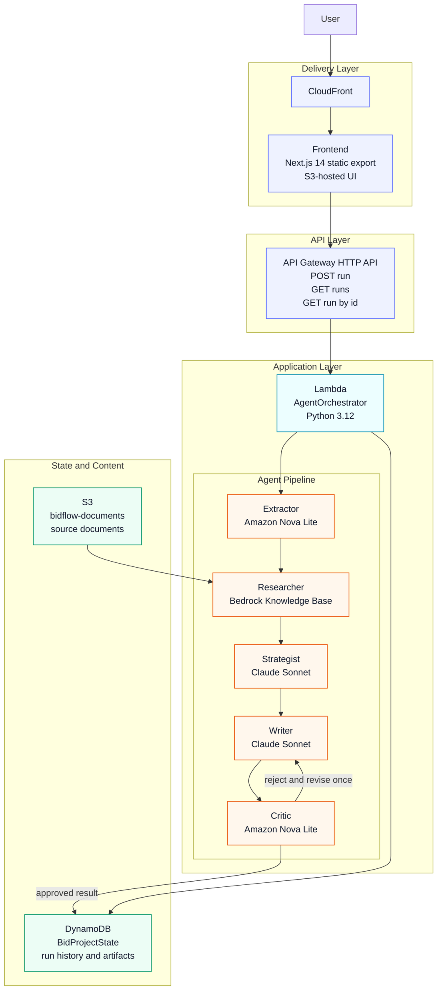

# BidFlow AI

Responding to enterprise RFPs is slow, error-prone, and expensive. A typical response requires days of cross-functional effort to extract requirements, gather evidence, align on strategy, draft sections, and verify compliance coverage. BidFlow compresses that workflow into an automated pipeline that completes in under a minute.

BidFlow AI is a multi-agent system that converts RFP documents into structured, compliance-aware proposals. The pipeline decomposes the response process into discrete stages - extraction, evidence retrieval, strategy, drafting, and critique - each handled by a purpose-built agent running on Amazon Bedrock.

## How It Works

A single Lambda function orchestrates five agents in sequence. Each agent receives structured input from the previous stage and produces structured output for the next.

| Stage | Agent | Model | Responsibility |
|-------|-------|-------|----------------|
| 1 | Extractor | Amazon Nova Lite | Parse RFP text into a JSON checklist of requirements and compliance terms |
| 2 | Researcher | Bedrock Knowledge Base | Retrieve top-k evidence chunks from company documents via RAG |
| 3 | Strategist | Claude Sonnet | Generate win themes, proof points, and risk mitigations from the checklist + evidence |
| 4 | Writer | Claude Sonnet | Draft a seven-section Markdown proposal grounded in the strategy |
| 5 | Critic | Amazon Nova Lite | Audit the draft against the original checklist; approve or reject with reasoning |

If the Critic rejects, the Writer revises using the feedback, and the Critic re-evaluates once. The final output - along with every intermediate artifact - is persisted to DynamoDB and returned to the caller.

---

## Architecture



The frontend serves a static Next.js workspace through S3 and CloudFront. Requests enter through API Gateway, which invokes a single Lambda orchestrator. That function runs the agent pipeline, retrieves supporting material from the Bedrock Knowledge Base backed by S3 documents, and persists run state plus generated artifacts to DynamoDB.

### AWS Services Used

| Service | Purpose |
|---------|---------|
| **Amazon Bedrock** | Model inference (Claude Sonnet, Nova Lite) and Knowledge Base retrieval |
| **Lambda** | Stateless orchestration of the agent pipeline |
| **API Gateway** | HTTP API with CORS for the frontend |
| **DynamoDB** | Run state, intermediate artifacts, and cost tracking |
| **S3** | Company document storage (KB source) and frontend static hosting |
| **CloudFront** | CDN for the static frontend export |
| **CloudWatch** | Lambda logging and operational metrics |

---

## Repository Structure

```
BidFlow AI/
├── backend/                   Lambda function source (Python 3.12)
│   └── src/
│       ├── handler.py         Entry point and orchestration logic
│       ├── bedrock.py         Bedrock model invocation and KB retrieval
│       ├── prompts.py         Prompt templates for each agent
│       ├── dynamo.py          DynamoDB read/write helpers
│       └── cost.py            Per-run cost estimation
├── frontend/bidflow-ui/       Next.js 14 application
│   └── app/
│       ├── page.tsx           Main workspace UI
│       ├── layout.tsx         Root layout and font configuration
│       └── globals.css        Design system and utility classes
├── infra/                     AWS CDK stack (TypeScript)
│   └── lib/
│       └── bidflow-stack.ts   All provisioned resources
├── scripts/                   Deployment and operations scripts
│   ├── deploy-all.sh          Recommended full-stack deploy
│   ├── deploy-infrastructure.sh
│   ├── setup-knowledge-base.sh
│   ├── test-backend.sh
│   └── cleanup.sh
├── docs/
│   ├── DEPLOYMENT-SUMMARY.md  Canonical deployment guide
│   └── sample-pdfs/           Sample company documents for KB
└── demo.html                  Standalone lightweight demo page
```

---

## Getting Started

### Prerequisites

- Node.js 18+
- Python 3.12+
- AWS CLI v2 with configured credentials
- AWS CDK CLI v2

### Local Development

```bash
cd frontend/bidflow-ui
npm install
cp .env.local.example .env.local    # then set NEXT_PUBLIC_API_BASE_URL
npm run dev                          # starts on localhost:3000
```

### Full Deployment

The recommended path deploys infrastructure, builds the frontend, and publishes everything in one pass:

```bash
./scripts/deploy-all.sh
```

For a staged deployment workflow, see [`docs/DEPLOYMENT-SUMMARY.md`](docs/DEPLOYMENT-SUMMARY.md).

---

## API

The backend exposes three routes through API Gateway:

| Method | Path | Description |
|--------|------|-------------|
| `POST` | `/run` | Submit RFP text; returns a `run_id` immediately (async execution) |
| `GET` | `/runs/{run_id}` | Poll for status and results of a specific run |
| `GET` | `/runs` | List run history for a project |

### Example

```bash
# Start a run
curl -X POST "$API_URL/run" \
  -H "Content-Type: application/json" \
  -d '{"project_id": "demo-001", "rfp_text": "..."}'

# Poll for results (after ~40 seconds)
curl "$API_URL/runs/{run_id}"
```

The completed response includes the final proposal Markdown, every intermediate artifact (checklist, evidence, strategy, drafts, critic feedback), elapsed time, and estimated cost.

---

## Technology

| Layer | Stack |
|-------|-------|
| Frontend | Next.js 14, React 18, TypeScript, Tailwind CSS, react-markdown |
| Backend | Python 3.12, boto3, Lambda |
| AI Models | Claude Sonnet (strategy + writing), Amazon Nova Lite (extraction + critique), Titan Embeddings v2 (KB) |
| Infrastructure | AWS CDK (TypeScript), API Gateway, Lambda, DynamoDB, S3, CloudFront |
| Export | Copy, Text, Word (.doc), PDF (jsPDF) |

---

## Further Reading

| Document | Scope |
|----------|-------|
| [`docs/DEPLOYMENT-SUMMARY.md`](docs/DEPLOYMENT-SUMMARY.md) | Deployment guide and script reference |
| [`backend/README.md`](backend/README.md) | Lambda modules, API contract, agent behavior |
| [`frontend/bidflow-ui/README.md`](frontend/bidflow-ui/README.md) | Frontend development and configuration |
| [`infra/README.md`](infra/README.md) | CDK stack and infrastructure details |

---

## License

This repository is licensed under the MIT License. See [`LICENSE`](LICENSE).

**Built with ❤️ using AWS Cloud, Kiro IDE**